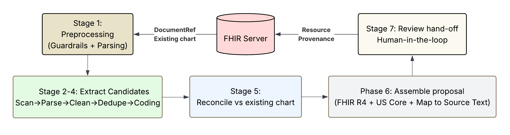

# Anamnesis Augmentation Pipeline

The deep-dive on how a clinical note becomes a clinician-reviewable, provenance-stamped FHIR write. Every stage is a pure function over typed Pydantic schemas; LLM calls are wrapped in telemetry; nothing here is demo-specific.

For the system shape (MCP surface, in-host review app, persistence) see [Architecture.md](Architecture.md). For benchmarked accuracy see [benchmarks/eval-corpus-v1/](benchmarks/eval-corpus-v1/).



## Stage 0 — Chart load (`backend/fhir/read.py`, `backend/fhir/local_bundle.py`)

Pulls the inputs the pipeline reasons over.

- `read_patient_context(fhir, patient_id)` → `PatientContext`: existing structured chart (Condition, MedicationRequest, AllergyIntolerance, Observation, FamilyMemberHistory, Procedure, Encounter).
- `read_documents(fhir, patient_id)` → `list[Document]`: DocumentReferences with decoded note text, encounter_id, and date metadata.
- `local_bundle.load_demo_data(path)` → same types from a local Bundle JSON, used for offline dev, tests, and the demo path that needs no FHIR server.

Each `Document` carries `encounter_id` extracted from `DocumentReference.context.encounter[0]`. When absent (uploaded docs with no FHIR link), downstream stages fall back to note date as the encounter grouping key.

Output is the only ground truth the pipeline uses. Nothing else re-reads FHIR until Stage 8.

## Stage 0.5 — Input guardrail (`backend/core/doc_guardrails.py`)

Per-document gate that runs *before* the expensive Stage 2 spend. Two-tier: deterministic checks first (free, instant), then a parallel `gemini-3.7-flash` semantic classification at `thinking_level="minimal"`. All notes screen concurrently via `asyncio.gather`.

**Why here.** Stage 2 fans out 1 + N parse calls per note; a single bad input costs real money. The gate filters obvious garbage, non-clinical text, and prompt-injection attempts before that fan-out begins.

**Deterministic checks** (`deterministic_check`):

| Check | Threshold | Catches |
|---|---|---|
| Empty / whitespace-only | non-whitespace required | empty uploads |
| Byte size | ≤ 256 KB | defense-in-depth above the 200 KB inline cap |
| Printable-char ratio | ≥ 0.85 | binary blobs, base64 mistakenly handed in as text |

**LLM check.** Single call per surviving doc. Structured output (`GuardrailVerdict`) classifies as one of `clinical | empty | non_clinical_text | binary_or_garbage | prompt_injection | other`. The system prompt is intentionally permissive on formatting — messy dictation, partial notes, and shorthand are all `clinical`. Verified 25/25 against the eval corpus + 6 synthetic noise samples (real notes including `pt 58F, c/o cp x 2d. trop neg…` accepted; news, code, base64, prompt-injection, empty all rejected).

**Failure model:**

- Per-doc rejection, never per-run. One bad note doesn't kill the run.
- API failure → fail-open (doc is accepted, rejection telemetry records the error).
- Result returned with the run as `{"accepted": N, "rejected": [{document_id, reason, category, detail}]}` so the review UI can badge skipped docs. Nothing is persisted.

**Cost & latency** (gemini-3.7-flash, `thinking_level="minimal"`):

- Per-call: ~1087 input tokens, ~73 output tokens, p50 ~1.5s, p95 ~2.5s.
- Per-call cost: ~$0.0003 — trivially cheap.
- 25 docs in parallel: 2.6s wall-clock.

**Caching.** Hash `(model, prompt_version, sha256(text))`. Re-runs of the same note (retries, demo bundle in tests) hit the cache and skip the API call entirely.

**Telemetry.** Recorded in the in-memory telemetry buffer as `stage="stage0"` / `call_type="doc_guardrail"`, so guardrail spend rolls up in the standard run summary alongside the other stages.

Disable via `DOC_GUARDRAIL_ENABLED=false` in `.env` if needed.

## Stage 1 — Preprocess (`backend/core/preprocess.py`)

Per note, deterministic, no I/O.

- Rule-based sentence split tuned for clinical text (titles, frequencies like `b.i.d`, decimals, inline list markers, section headers).
- Build a `numbered_note` where every sentence is prefixed `[N]` — this number is the universal address used by every downstream LLM call.
- Each `SentenceSpan` records `(number, start_char, end_char, text)` with exact byte offsets in the original note for provenance.
- `encounter_id` passes through from Document to `PreprocessedNote`.

`NoteContext` (note_date, admission_date, discharge_date) is extracted by the scanner in Stage 2, not in Stage 1.

Singleton extraction (Patient/Encounter/etc.) is intentionally skipped — Anamnesis already has them from SHARP context and `DocumentReference.context`.

## Stage 2 — Extract candidates (`backend/core/extraction.py`)

Scan → parse → clean, per note, all notes in parallel via `asyncio.gather`. Model: `gemini-3.7-flash` at `thinking_level="low"`.

1. **Scan.** One LLM call per note classifies which sentence numbers hold clinical content. Output is sentence-number groups per resource type (Condition, Observation, MedicationRequest, Procedure, AllergyIntolerance, FamilyMemberHistory). Routing priority rules prevent cross-type leakage (allergies → AllergyIntolerance only, family history → FamilyMemberHistory only, tobacco → Observation only).
2. **Parse.** One LLM call per sentence group per resource type, all concurrent within a note. Produces Pydantic structured outputs. Each candidate carries `source_sentences`, `reasoning`, and `certainty` (definite / probable / uncertain — how assertively the source text states the fact).
3. **Clean.** One LLM call per resource type (within-note only) removes junk and de-duplicates near-identical candidates.

Parser prompts accept `NoteContext` so "started yesterday" becomes a real ISO date. Prompts enforce strict exclusion rules: no pertinent negatives in Observations, no generic drug names in MedicationRequests, no ruled-out conditions, no billing-code duplicates.

Output: `list[StageTwoOutput]` — one per note, each carrying `document_id`, `encounter_id`, `note_context`, and `candidates` grouped by resource type. Cached by `(note_hash, model, prompt_version)`.

## Stage 3 — Cross-note dedupe (`backend/core/extraction.py::merge_across_notes`)

Merges duplicate candidates across notes into single items with multi-document `source_refs`. Encounter-scoped: patient-level resources dedupe globally, encounter-level resources dedupe only within the same encounter.

**Resource scoping:**

| Scope | Types | Rationale |
|-------|-------|-----------|
| Patient-level | Condition, MedicationRequest, AllergyIntolerance, FamilyMemberHistory | Chart state — "hypertension" is one fact regardless of which visit mentions it |
| Encounter-level | Observation, Procedure | Measurements and events — BP from cardio ≠ BP from neuro |

**Encounter key derivation:** `encounter_id` (from DocumentReference) → note date (YYYY-MM-DD) → document_id (last resort). Two notes on the same day with no encounter_id are assumed to be the same encounter.

**Two-phase algorithm:**

1. **Deterministic exact-match merge** (zero LLM calls). Tag items with `(resource_type, encounter_key, normalized_name, value/dose)`. Normalize: lowercase, strip clinical-irrelevant prefixes (essential, chronic, acute, mild, moderate, severe, minor). Group by key. Multi-doc exact matches merge deterministically — pick the most complete item as survivor, union all SourceRefs.

2. **LLM adjudication** for fuzzy near-duplicates within the same scope. All calls run in parallel via `asyncio.gather`:
   - 1 call for patient-level ambiguous groups (e.g. "coronary artery disease" vs "two-vessel coronary artery disease")
   - 1 call per encounter for encounter-level ambiguous groups (if any)

   Model: `gemini-3.7-flash`, `thinking_level="low"`. The LLM returns merge / reassign / keep decisions with reasoning. Unconsumed groups pass through as singletons.

**Output:** `StageThreeOutput` — a flat list of `MergedCandidate`, each with:
- `resource_type`, `item` (dict), `source_refs` (multi-doc provenance)
- `encounter_key` (for encounter-level items, None for patient-level)
- `merge_reasoning` (audit trail)

## Stage 4 — Terminology coding (`backend/core/code_candidates.py`, `backend/core/retrieval.py`)

Live authoritative-API retrieval + LLM CodeSelector + US Core / mCODE fixed-code short-circuits. Model: `gemini-3.7-flash` at `thinking_level="low"`.

**Retrieval backend (`core/retrieval.py`):** a pluggable `Retriever` seam. The default `ApiRetriever` routes each system to its authoritative service and merges results behind a shared concurrency limiter:

| System | Backend | Key |
|--------|---------|-----|
| SNOMED | UMLS UTS | `UMLS_API_KEY` required |
| RxNorm | RxNav `approximateTerm` | none |
| ICD-10 | NLM Clinical Tables | none |
| LOINC | NLM Clinical Tables | none |

No local index or embedding model is required and codes are always current, so there is no warmup step on the default path. A local SapBERT + FAISS adapter exists behind the same seam as a non-default option (see [DIRECTION.md](DIRECTION.md), "terminology retrieval benchmark").

**Per candidate flow:**

1. **Fixed-code short-circuit.** Preset term→code overrides win first; then mCODE concepts (when active); then US Core vitals / smoking status get fixed LOINC codes instantly (BP → 85354-9, tobacco → 72166-2, body weight → 29463-7, etc.). FamilyMemberHistory relationship gets a fixed v3-RoleCode (`father→FTH`, `mother→MTH`, …). No retrieval, no LLM.
2. **Search-term extraction.** Per resource type, extract one or more `(term, [systems])` jobs from the item (Condition/MedicationRequest/Procedure → name; AllergyIntolerance → substance + reaction separately; FamilyMemberHistory → each `conditions[].name` separately).
3. **Query-variant expansion.** For each term, generate several variants: original, strip laterality (`left/right/bilateral`), strip trailing parens, strip dose tokens (`10 mg`, `5 mcg`, …), strip leading severity (`severe/moderate/mild/acute/chronic/...`), strip trailing qualifiers (`NOS`, `unspecified`), and abbreviation expansion via a built-in map (`htn→hypertension`, `dm2→type 2 diabetes mellitus`, `cad→coronary artery disease`, ~25 entries). Variant emission is the decisive recall lever (see DIRECTION.md appendix).
4. **Union retrieval.** Every variant for a job is queried against the routed system(s) via the `Retriever`; results are merged by code keeping the best score, re-ranked, kept top-10. On a total miss the job retries with broader backoff variants.
5. **LLM CodeSelector.** Picks the best code from the top-10, or returns a `refined_search_term` for one retry (re-query → re-select).
6. **Fallback.** Text-only coding `[{"text": term}]` if all attempts fail.

**Resource → code system routing:**

| Resource type | Systems | Notes |
|---|---|---|
| Condition | SNOMED + ICD-10 | Dual coding, both in parallel |
| Observation | LOINC or SNOMED | Routed by `codeset_hint` from parser |
| MedicationRequest | RxNorm | |
| Procedure | SNOMED | |
| AllergyIntolerance | SNOMED | |
| FamilyMemberHistory | SNOMED | Each condition coded separately |

All candidates processed in parallel via `asyncio.gather`; within a candidate, every `(term, system)` pair runs as its own task in parallel too.

**No term-level cache by design.** A `(term, system) → code` cache could silently re-apply a code that a clinician corrected via the HITL review surface, so it is deliberately omitted in favor of correctness. This is the one stage with no warm-cache path: every run re-queries the live terminology APIs. A production deployment could add a HITL-invalidating cache — see the optimization notes for the latency tradeoff.

Output: `StageFourOutput` — same `MergedCandidate` list with `coding` field injected into each item dict. Structure mirrors FHIR `CodeableConcept.coding[]`: `[{system, code, display}]`. AllergyIntolerance also writes `reaction_coding` separately; FamilyMemberHistory writes per-condition `conditions[i].coding`.

## Stage 5 — Reconcile vs existing chart (`backend/core/reconcile.py`)

The augmentation brain. This is the capability text2fhir does *not* have.

**Two-tier approach:** deterministic code match first (no LLM), then LLM adjudication only for ambiguous cases where codes differ but display text overlaps. Typically 0–2 LLM calls per run.

**Per-resource-type matching:**

| Resource | Strategy | Example |
|----------|----------|---------|
| Condition | exact (system, code) match → DUPLICATE; display overlap → LLM | HTN ICD-10 I10 match → DUPLICATE |
| MedicationRequest | exact RxNorm → DUPLICATE; ingredient substring + dose compare → UPDATING | lisinopril 10→20 mg |
| AllergyIntolerance | specific allergy vs NKDA (409137002) → CONFLICTING | penicillin vs NKDA |
| Observation | LOINC match + tobacco-status normalization → UPDATING if value changed | smoking current→former |
| Procedure | SNOMED code + date match → DUPLICATE; different date → NEW |  |
| FamilyMemberHistory | relationship code + condition code match |  |

**LLM batching by resource type.** Ambiguous candidates grouped by type, one LLM call per type (max 6, typically 0–1), all in parallel via `asyncio.gather`. Model: `gemini-3.7-flash`, `thinking_level="low"`.

**Output:** `StageFiveOutput` — `list[ReconciliationResult]`, each wrapping the original `MergedCandidate` + `classification` (NEW / DUPLICATE / UPDATING / CONFLICTING) + `reasoning` + `chart_matches` (refs to matched existing resources) + `confidence_breakdown` (see [Confidence scoring](#confidence-scoring) below).

For benchmarked classification accuracy by class (NEW / DUPLICATE / UPDATING / CONFLICTING) see [benchmarks/eval-corpus-v1/results/](benchmarks/eval-corpus-v1/results/).

## Stage 6 — Assemble proposal (`backend/core/augment/assembly.py`)

Pure deterministic transform — no LLM calls, no I/O. Converts `StageFiveOutput` into clinician-reviewable `Proposal` records with valid FHIR R4 resource JSON and character-level source citations.

**Four jobs:**

1. **Filter.** Drop DUPLICATEs (already in chart). Only NEW / UPDATING / CONFLICTING reach the review surface.
2. **Build FHIR resources.** One builder per resource type, emitting plain dicts that conform to US Core R4. Key mapping: `item["coding"]` → `CodeableConcept.coding[]`, `item["name"]` → `CodeableConcept.text`. Special handling for BP (component-based), tobacco (valueCodeableConcept), and onset age parsing for FamilyMemberHistory.
3. **Resolve citations.** Sentence numbers → character spans via `PreprocessedNote.sentences`. Contiguous sentences merge into one `ResolvedCitation`; non-contiguous produce multiple.
4. **Detect inter-proposal conflicts.** After all proposals are assembled, a rule-based pass (`_detect_inter_proposal_conflicts`) groups proposals that contradict each other across notes. For medications: same normalized ingredient + contradictory statuses (one stopped, one active/dose-change) → shared `conflict_group_id`, both forced to ATTENTION tier. On accept, siblings in the same group are auto-rejected. This catches medication reconciliation failures across care settings (e.g., cardiology discontinues lisinopril, neurology increases it one month later).

**Per-type assembly:**

| Type | Code field | Subject field | Profile |
|------|-----------|--------------|---------|
| Condition | `code` | `subject` | us-core-condition-problems-health-concerns |
| Observation | `code` | `subject` | varies by category (vital-signs, lab, smokingstatus) |
| MedicationRequest | `medicationCodeableConcept` | `subject` | us-core-medicationrequest |
| Procedure | `code` | `subject` | us-core-procedure |
| AllergyIntolerance | `code` | `patient` | us-core-allergyintolerance |
| FamilyMemberHistory | `relationship` | `patient` | (none) |

**certainty → verificationStatus:** `definite` → confirmed, `probable` → provisional, `uncertain` → unconfirmed (Condition + AllergyIntolerance).

**Output:** `Proposal` schema carrying:
- `resource` (valid FHIR R4 dict), `resource_type`, `classification`
- `citations` (list of `ResolvedCitation` with document_id, char_start/end, text)
- `confidence_score`, `confidence_tier`, `flags` (carried from Stage 5)
- `supersedes` (UPDATING), `chart_matches` (any classification with chart hits)
- `conflict_group_id` (shared ID linking inter-proposal conflicts, null if none)
- `classification_reasoning`, `extraction_reasoning`, `merge_reasoning`

No FHIR write happens here. The assembled proposals are returned to the caller and held only in an in-process TTL cache (`services/session_cache.py`) so an accept can resolve them by `run_id`; nothing is persisted to disk.

## Stage 7 — Review hand-off (`backend/services/proposals.py`)

The pipeline's terminal stage from the engine's perspective. `run_extraction_ephemeral` is **stateless**: it returns proposals + source notes to the caller (the in-host MCP app) and holds them briefly in an in-process TTL cache (`services/session_cache.py`) keyed by `run_id`, so a later `AcceptAugmentation` can resolve the full proposal without re-running. **No PHI is persisted** — there is no `ProposalRecord`, `PipelineRun`, or `ReviewToken` table; those were removed when the stack went stateless.

What this stage emits:

- The proposal list + source documents, returned over MCP and cached in-process (TTL) for the accept path.
- One `UsageRun` row — a non-PHI usage-ledger aggregate (model, token counts, cost, duration, doc count; no patient id, no clinical content) via `services/usage.py`.
- Telemetry: per-call token/cost rows in the in-memory buffer and a JSONL file under `.cache/telemetry/` (non-PHI).

The interactive review surface (MCP tools, the in-host React app) is documented in [Architecture.md](Architecture.md).

## Stage 8 — Write-back (`backend/fhir/write.py`)

On accept, `apply_augmentation(client, proposal)` writes to the FHIR server atomically (transaction Bundle) with full multi-citation Provenance.

**Three classification flows:**

| Classification | FHIR operation | Provenance activity | Behavior |
|---|---|---|---|
| NEW | POST resource + POST Provenance | CREATE | New resource added to chart |
| UPDATING | PUT to existing ref + POST Provenance | UPDATE | Replaces existing resource (e.g., dose change) |
| CONFLICTING | POST resource + POST Provenance | CREATE | New resource created; existing NOT retired (separate clinical decision) |

**Multi-citation Provenance:** each source document gets its own `entity` entry. Each citation span gets its own `source-text-span` extension with `documentRef`, `start`, `end`, `text`. A condition corroborated by 3 notes produces 3 extension entries and up to 3 entity entries (deduplicated by document).

**UPDATING flow:** reads the existing resource to get its `id` and `versionId`, merges the proposal's resource, PUTs to the same reference. The `supersedes_ref` from Stage 5 reconciliation provides the target.

**Inline note minting:** when a citation references an inline `Document` (no FHIR `DocumentReference` yet), `_resolve_inline_citations` mints one US Core `DocumentReference` per unique inline document into the same transaction Bundle (LOINC `34109-9 Note` default, base64 inline content, `clinical-note` category, `Patient/{id}` subject, attester as `author`) and rewrites the citation's `document_ref` to that entry's `urn:uuid:` so Provenance points at it correctly. Inline source text only enters the chart when its derived augmentation is accepted, in the same transaction.

**Write result:** `WriteResult(resource_ref, provenance_ref, superseded_ref)` returned to the service layer, stored in the proposal audit trail.

Rejections are recorded as a non-PHI structured log line (`record_decision`); no clinical content and no working DB are involved.

---

## Module layout

```
backend/core/
  doc_guardrails.py        # Stage 0.5: deterministic + nano-LLM input gate
  preprocess.py            # sentence splitter + NoteContext extractor
  extraction.py            # Stage 2: scan → parse → clean (re-exports merge_across_notes)
  extraction_merge.py      # Stage 3: cross-note dedupe (deterministic + LLM adjudication)
  validation.py            # post-parse validators for Stage 2 output
  schemas.py               # Stage 2 Pydantic schemas (source_sentences + reasoning)
  retrieval.py             # Stage 4: pluggable Retriever seam (default ApiRetriever over live terminology APIs)
  code_candidates.py       # Stage 4: fixed codes (preset/mCODE/US Core) + variant retrieval + LLM CodeSelector
  reconcile.py             # Stage 5: deterministic match + LLM adjudication → NEW/DUPLICATE/UPDATING/CONFLICTING
  reconcile_match_rules.py # Stage 5: per-resource-type matchers (ChartIndex)
  augment/
    assembly.py            # Stage 6 entry point: filter, build, cite, detect inter-proposal conflicts
    builders.py            # per-resource-type FHIR builders + dispatch
    citations.py           # sentence numbers → character spans, encounter resolution
    config.py              # US Core profile URLs, terminology system URIs, lookup maps
    helpers.py             # CodeableConcept + parsing helpers shared by builders
  prompts/
    stage1_scan.py         # scan-stage system prompt
    stage2_parse.py        # per-resource-type parser prompts
    stage3_merge.py        # cross-note dedupe adjudication prompt
    stage4_coding.py       # CodeSelector prompt
    stage5_reconcile.py    # reconciliation adjudication prompt
  cache.py                 # content-addressed JSON cache shared across stages
  ids.py                   # short Crockford-base32 IDs (run_, prop_, aug_)
  telemetry.py             # RunContext + LLM call wrapper (token + cost accounting)
  pricing.py               # per-model token pricing for USD cost computation

backend/services/
  proposals.py             # stateless entry points: run pipeline (ephemeral), accept, record decision
  session_cache.py         # in-process TTL cache of a run's proposals + docs for the accept path
  usage.py                 # non-PHI usage-ledger writes/reads (UsageRun)
  users.py                 # per-clinician config (AppUser) read/merge

backend/fhir/
  client.py                # async FhirClient (read, search, transaction)
  read.py                  # PatientContext + Document loaders
  write.py                 # apply_augmentation: NEW/UPDATING/CONFLICTING write paths
  local_bundle.py          # offline Bundle loader for demo + tests
  bootstrap.py             # idempotent loader for the James Lee demo bundle
  models.py                # plain dataclasses for FHIR data read into Python
```

---

## Confidence scoring

Every `ReconciliationResult` carries three confidence outputs:

- `confidence_score: float` — 0.0–1.0, used for sort order
- `confidence_tier: CONFIDENT | REVIEW | ATTENTION` — UI display tier
- `flags: list[str]` — human-readable reasons the clinician can verify

### Why not LLM confidence scores?

LLMs are poorly calibrated at self-reported numeric confidence. They say 0.85 whether they're right or wrong. Instead, we use one LLM **label** at extraction time (`certainty: definite | probable | uncertain` — the LLM *is* good at categorical language classification) and combine it with a **deterministic coding-quality signal** from Stage 4 that is more trustworthy than any self-reported number.

### Two factors

| # | Factor | Weight | Source | Signal |
|---|--------|--------|--------|--------|
| 1 | Extraction certainty | 0.50 | Stage 2 (+ Stage 3) | LLM label `definite/probable/uncertain`, promoted one level when ≥2 notes corroborate the fact |
| 2 | Coding quality | 0.50 | Stage 4 | Real terminology code found (1.0; text-only fallback → 0.3), with the display naming how many systems agree |

`composite = 0.5·certainty + 0.5·coding`. Source corroboration folds into the certainty factor (a `probable` fact seen in two notes is promoted toward `definite`) rather than scoring as its own axis. The reconciliation classification does not enter the numeric score — it drives hard tier overrides instead (below).

**Coding quality** is the strongest independent check: if the retriever cannot ground the mention in any terminology system, either the extraction is wrong or the concept is unusual, so the text-only fallback halves that axis. **Certainty** carries the LLM's own read of how assertively the source states the fact, promoted when multiple notes corroborate — so a single hedged mention scores lower than the same fact stated plainly across three notes.

### Tier thresholds

```
CONFLICTING                                                  → ATTENTION  (hard override, no exceptions)
AllergyIntolerance with uncertain certainty or no real code  → ATTENTION
composite ≥ 0.80                                             → CONFIDENT  (downgraded to REVIEW if no real code)
composite ≥ 0.40                                             → REVIEW
composite < 0.40                                             → ATTENTION
```

CONFLICTING always forces ATTENTION regardless of score. This is a safety invariant — a clinical contradiction must never be auto-approved.

### Flags (what clinicians actually see)

The tier tells the clinician *how much attention* to pay. The flags tell them *where to look*. Each flag is derived from the same signals:

- Source: "Mentioned in 3 notes" / "Single mention"
- Certainty: "Stated assertively in source" / "Source language is uncertain"
- Coding: "Coded in 2 systems (icd-10-cm, sct)" / "No terminology code found — verify manually"
- Classification: "Already in chart" / "Conflicts with: No known drug allergy" / "Updates existing: dose 10→20"
- Match: "Approximate match — verify"

---

## Design invariants

- **Sentence numbers are the universal address.** Every LLM call references sentences by `[N]`; source spans are derived from `sentence_positions`.
- **Single-model default, tier-ready.** All stages currently run on one flash-class model (`gemini_model_fast`). The `core/llm.py` wrapper takes a per-call model, so a stronger model can be routed to ambiguous reconciliation/merge calls without structural change — `gemini_model_smart` is a distinct setting, presently pinned to the same model (see the optimization notes).
- **Pluggable terminology + embeddings.** No vendor endpoint is hardcoded.
- **Stage-2 extraction is cached by `(note_hash, model, prompt_version)`** so dev re-runs over the same notes are free. Stage 4 (terminology coding) is intentionally **not** cached — a stale cache could silently re-apply a code that a clinician corrected via HITL.
- **Provenance is non-negotiable.** A proposal without `source_refs` is a bug; a write without a `Provenance` resource is a bug.
- **Nothing writes silently.** Stages 0–7 never touch the FHIR server; only Stage 8 does, and only on explicit accept.
