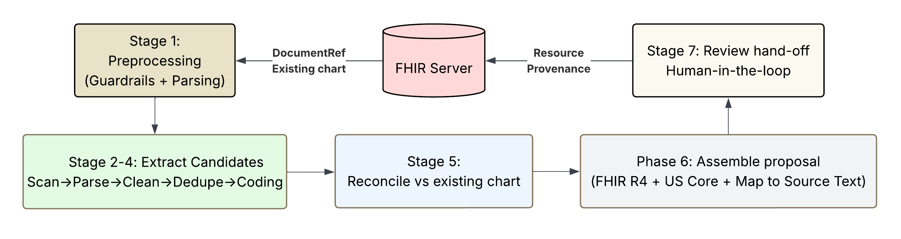
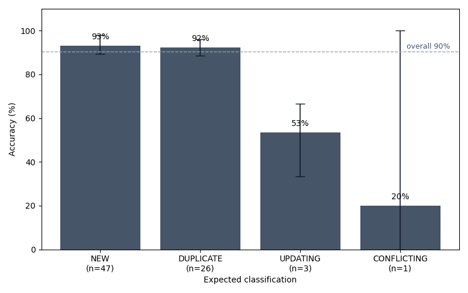

# Anamnesis

> The data wasn't missing — it was unstructured. Now it's not.

A FHIR augmentation agent for the **Agents Assemble: The Healthcare AI Endgame** hackathon. Anamnesis reads clinical notes against an existing FHIR record, proposes additions and corrections with full source provenance, and writes them back to the FHIR server only after a clinician approves them.

The product ships as an **MCP server** (the substantive deliverable, invokable by any agent in the Prompt Opinion ecosystem) plus a **provider-facing review workspace** that handles the human-in-the-loop hand-off.

## How it works



Six stages from clinical note to clinician-reviewable proposal, plus a deterministic write-back stage on accept. Deterministic where it can be (sentence splitting, terminology lookup, code matching, FHIR assembly), LLM-driven where it must be (extraction, fuzzy reconciliation). Every accepted change writes back as a transaction Bundle with a `Provenance` resource that points at the source span — an audit trail manual chart review does not produce.

See [ARCHITECTURE.md](ARCHITECTURE.md) for the system shape and [PIPELINE.md](PIPELINE.md) for the per-stage deep-dive.

## What we built

- **MCP server** — nine tools covering patient context, augmentation proposals (chart-resident and inline notes), and proposal lifecycle (accept / reject / reopen / edit). Streamable HTTP at `/mcp`. SHARP-aware.
- **Augmentation pipeline** — six stages plus a per-doc input guardrail (deterministic + `gpt-5.4-nano`), dual-coded terminology against 1M+ SNOMED / ICD-10 / LOINC / RxNorm concepts via FAISS, deterministic chart reconciliation with LLM adjudication only for ambiguous cases.
- **Review workspace** — Next.js deep-link UI showing source notes, the chart slice, classification, confidence breakdown, and accept / edit / reject actions. Streaming chat assistant per run.
- **Eval corpus + benchmark runner** — 18 multi-source clinical notes × 13 patient charts × 77 labeled facts, with multi-run accuracy / consistency / provenance reporting.

## Benchmark headline

| Metric | Value |
|---|---|
| Augmentation accuracy | 90% [87%, 95%] |
| Consistency (correct in ≥4/5 runs) | 88% |
| Provenance coverage | 100% |
| Cost per chart prep (3 notes) | ~$0.13 |
| End-to-end latency per chart prep | ~5 min wall-clock |



NEW (93%) and DUPLICATE (92%) — the bulk of real clinical findings — both clear 90% with tight variance. UPDATING and CONFLICTING are thin slices (n=3 and n=1); the wide error bars are honest sample-size acknowledgment, not hidden failures.

5 runs · `gpt-5.4-mini` (pipeline) · `gpt-5.4-nano` (guardrail) · 18 notes × 13 fixtures × 77 facts. Full per-class accuracy, confusion matrix, stability buckets, per-stage cost breakdown, and reproducibility instructions in the latest [REPORT.md](benchmarks/eval-corpus-v1/results/20260504T015004Z/REPORT.md).

## Demo flow

1. **Pre-visit catch-up.** A clinician asks the agent to prepare a chart. The agent calls `ProposeAugmentations` over MCP. SHARP headers carry the FHIR base URL, an access token, and the patient ID.
2. **Pipeline runs.** Backend pulls the existing chart and notes, runs the six-stage augmentation, and persists proposals tiered by confidence. The MCP tool returns a deep link to the review workspace.
3. **Clinician reviews.** Each proposal shows the source span highlighted in the original note, the FHIR resource Anamnesis would write, the classification (NEW / UPDATING / CONFLICTING), a confidence breakdown, and any conflict with the existing chart.
4. **Mid-encounter capture.** The agent uploads transcript text via `ProposeAugmentationsFromNotes`. Same pipeline, same review surface — the transcript itself is **not** written to FHIR yet.
5. **Accept.** On accept, `apply_augmentation` writes a single transaction Bundle: the resource, a `Provenance` with one entity per source document and one source-span extension per citation, and — for inline notes — a US Core `DocumentReference` carrying the source text. Nothing reaches the chart silently.

## Run it locally

Prereqs: Python 3.11+, Node 20+, an OpenAI API key. The demo path uses a local FHIR Bundle so judges don't need a FHIR server.

### Backend

```bash
cd backend
python -m venv .venv
source .venv/bin/activate          # Windows: .venv\Scripts\activate
pip install -e ".[dev]"
cp .env.example .env               # then fill OPENAI_API_KEY
uvicorn main:app --reload --port 8042
```

Sanity check: `curl http://localhost:8042/health` → `{"status":"ok","service":"anamnesis"}`.

### Frontend

```bash
cd frontend
npm install
npm run dev          # http://localhost:3042
```

### Reproduce the benchmark

```bash
cd benchmarks/eval-corpus-v1
python run_demo_benchmark.py --runs 5
```

Re-render the report from a prior run (no API spend): `python run_demo_benchmark.py --rerender results/<timestamp>`.

### Optional — expose to Prompt Opinion via ngrok

```bash
ngrok http --domain=<your-domain>.ngrok-free.dev 8042
```

Register the public `/mcp` URL in **Workspace Hub → Add MCP Server** with Streamable HTTP transport and SHARP context enabled.

## Repo layout

```
anamnesis/
  backend/             FastAPI + FastMCP server, augmentation pipeline, FHIR I/O
  frontend/            Next.js review workspace
  benchmarks/          Eval corpus + multi-run benchmark
  data/demo_patient/   Synthetic Bundle + four notes for offline demos
  ARCHITECTURE.md      System shape, contracts, invariants
  PIPELINE.md          Per-stage augmentation pipeline deep-dive
```

## Docs

- [ARCHITECTURE.md](ARCHITECTURE.md) — system shape, MCP contract, persistence, frontend, contracts, out-of-scope
- [PIPELINE.md](PIPELINE.md) — six-stage augmentation pipeline + write-back, confidence scoring
- [benchmarks/eval-corpus-v1/README.md](benchmarks/eval-corpus-v1/README.md) — eval corpus design, label schema, reproducibility

## Links

- Hackathon: <https://healthcareagents.devpost.com>
- SHARP-on-MCP spec: <https://sharponmcp.com>
- Reference MCP: <https://github.com/darena-solutions/darena-health-community-mcp>
