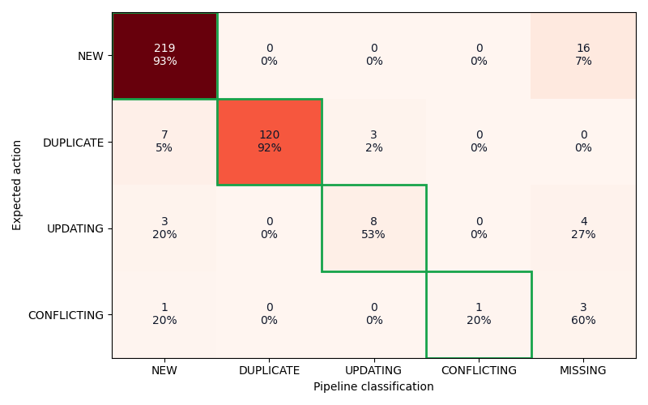
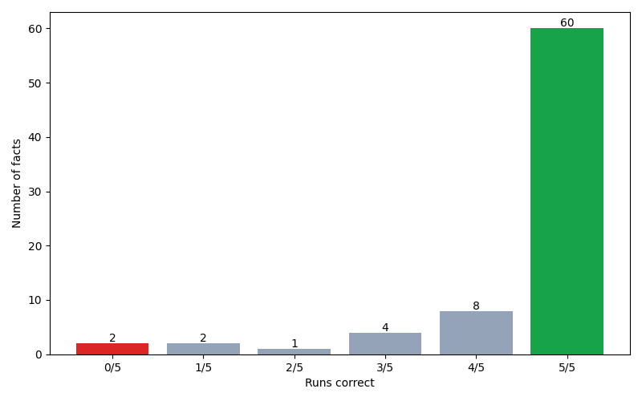
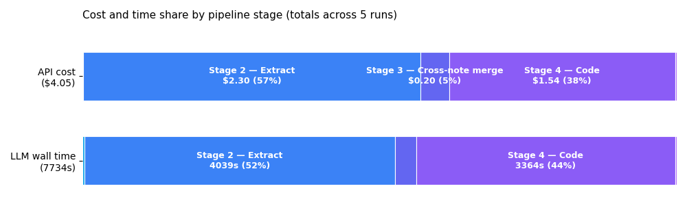

# Anamnesis augmentation benchmark — 2026-05-04 02:15 UTC

**90% augmentation accuracy · 88% of facts correct in ≥4 of 5 runs · 100% provenance coverage**

## Why this matters

Anamnesis turns unstructured clinical narrative into structured FHIR augmentations a provider can review in seconds rather than minutes. On this benchmark — 18 multi-source notes against 13 patient charts — the pipeline correctly classifies 90% of candidate facts: surfacing genuine new findings, suppressing duplicates the chart already contains, and flagging dose changes that read as routine prose. Every accepted change writes back to FHIR with a Provenance resource pointing at the source span — an audit trail manual chart review does not produce. The hypothesis: faster pre-visit chart catch-up, fewer missed updates, and a record of *why* every structured fact entered the chart.

## What was tested

18 clinical notes (cardiology, ED, neurology) × 13 FHIR chart fixtures × 77 labeled facts × 5 runs. Notes span clean / messy / trap difficulty tiers. All evaluation labels are checked into the repo at `benchmarks/eval-corpus-v1/`.

## Headline

| Metric | Value |
|---|---|
| Augmentation accuracy | 90% [87%, 95%] |
| Consistency (correct in ≥4/5 runs) | 88% |
| Provenance coverage | 100% |


## Per-class accuracy

| Class | Facts | Accuracy |
|---|---|---|
| NEW | 47 | 93% [89%, 98%] |
| DUPLICATE | 26 | 92% [88%, 96%] |
| UPDATING | 3 | 53% [33%, 67%] |
| CONFLICTING | 1 | 20% [0%, 100%] |

_Sample sizes reflect the corpus distribution. UPDATING (n=3) and CONFLICTING (n=1) are thin slices — the metrics are honest but variance is large (a single fact moves the CONFLICTING column by 100 percentage points). Expanding CONFLICTING coverage is a known gap; the labeled case (sulfa allergy disclosure against an existing NKDA record) is the kind of contradiction the pipeline is designed to flag for human review._


## Confusion matrix

Cells aggregate counts across all 5 runs (5 × 77 = 385 classifications). Rows = expected, columns = actual. The `MISSING` column captures facts the pipeline failed to extract or surface as a candidate.




## Consistency

Per-fact hit rate across 5 runs. The `5/5` bar is the production-ready set; the `0/5` bar is stable-wrong.




## Per-tier robustness

| Tier | Accuracy |
|---|---|
| clean | 94% [90%, 97%] |
| messy | 86% [80%, 90%] |
| trap | 90% [81%, 96%] |

## Where errors come from

Each misclassified fact traces to one of three pipeline stages.

| Source | Errors | Share |
|---|---|---|
| Extraction miss (fact never reached pipeline) | 23 | 62% |
| Coding miss (right fact, wrong code) | 12 | 32% |
| Reconciler miss (right fact, right code, wrong class) | 2 | 5% |

## Stability

| Bucket | Facts |
|---|---|
| Stable-right (correct in 5/5 runs) | 60 |
| Flaky (1..4 correct) | 15 |
| Stable-wrong (0/5 correct) | 2 |


### Stable-wrong cases

| Fact | Expected | Always classified as | Distribution |
|---|---|---|---|
| `C5-F3` | DUPLICATE | NEW | `{"NEW": 5}` |
| `N4-F2` | UPDATING | MISSING | `{"MISSING": 4, "NEW": 1}` |

## Where time and money go

Per-run averages across 5 runs. LLM-call wall time aggregates concurrent calls — actual end-to-end wall time per run is lower thanks to `asyncio.gather` parallelism.

| Stage | Model | Calls / run | Tokens (in / out) / run | Cost / run | LLM wall / run |
|---|---|---|---|---|---|
| Guardrail | `gpt-5.4-nano` | 3 | 4.5k / 257 | $0.0012 | 5.4s |
| Stage 2 — Extract | `gpt-5.4-mini` | 366 | 584.4k / 61.4k | $0.459 | 807.9s |
| Stage 3 — Cross-note merge | `gpt-5.4-mini` | 34 | 32.3k / 3.4k | $0.039 | 56.4s |
| Stage 4 — Code | `gpt-5.4-mini` | 435 | 231.6k / 29.9k | $0.308 | 672.9s |
| Stage 5 — Reconcile | `gpt-5.4-mini` | 1 | 789 / 355 | $0.0022 | 4.3s |

**Per-run averages:** 853.6k in / 95.2k out · $0.810 · 1547s of LLM time.

**Total across 5 runs:** 4201 calls · 4.3M in / 476.2k out · **$4.05** in API spend.



## Per-unit economics

Derived from the per-run averages above. The benchmark pairs each note with one fixture; in production a chart prep typically bundles 3–8 notes per patient.

| Unit | Cost | Note |
|---|---|---|
| Per source note | $0.045 | benchmark mean |
| Per labeled fact surfaced | $0.011 | accepted + filtered |
| Per chart prep, 3 notes (typical) | $0.135 | extrapolated |
| Per chart prep, 8 notes (dense) | $0.360 | extrapolated |
| End-to-end latency per chart prep | ~5 min (parallel-bound, near-flat in note count) | benchmark wall-clock |

**ROI sanity check.** A US clinician's loaded time is ~$3/min. If a chart prep saves 10 minutes of pre-visit reading, the cost-benefit is roughly **222× return** ($0.135 spent vs ~$30 of clinician time saved).

**Cost factors (in priority order):**
1. **Number of clinical findings extracted** — Stage 4 (coding) fans out per candidate. A 20-finding cardiology consult costs ~3× a 7-finding follow-up.
2. **Number of source notes** — Stage 2 (extraction) fans out per note × resource type. Linear in notes.
3. **Note length** — Stage 2 input tokens grow sub-linearly because the scan culls early.
4. **Chart size** — mostly free. Stage 5 (reconcile) is deterministic-match-first; the LLM fires only on fuzzy display-text overlaps (typically 0–2 calls/run).
5. **Cache state** — terminology codes (Stage 4) and guardrail verdicts cache across patients and re-runs. Production steady-state is materially cheaper than this cold-cache benchmark.

## Reproduce

```bash
git clone <repo> && cd anamnesis
export OPENAI_API_KEY=sk-...
python benchmarks/eval-corpus-v1/run_demo_benchmark.py --runs 5
```

## Run metadata

- Models: `gpt-5.4-mini` (pipeline) · `gpt-5.4-nano` (guardrail)
- Runs: 5
- Wall time: 1518s (304s/run)
- Total LLM calls: 4201
- Total API cost: $4.05
- Pipeline sha: `3851866`
- Prompt version: `2026-05-03.08`
- Generated: 2026-05-04 02:15 UTC
